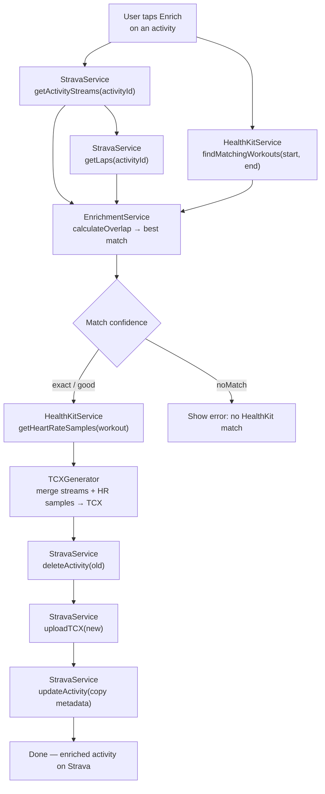
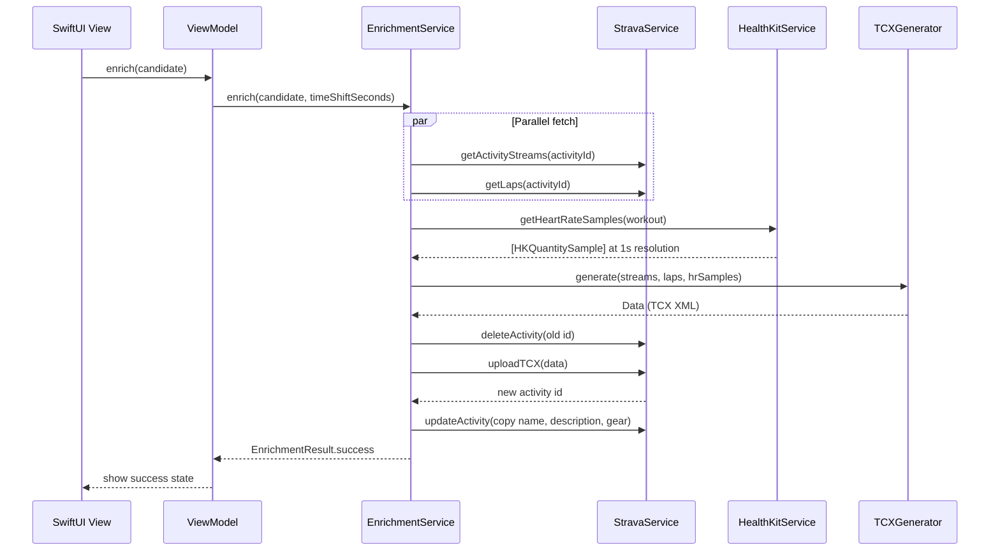

# ZwiftSync — Architecture

## Overview

A pure SwiftUI iOS app with no backend. All data stays on-device: Strava is queried via OAuth, HealthKit provides heart rate data, and the merged activity is re-uploaded to Strava as a TCX file. No server, no database, no cloud storage.

---

## Enrichment Pipeline



---

## Module Structure

```
ZwiftSync/Sources/
├── App/
│   ├── ZwiftSyncApp.swift      # App entry point, environment setup
│   ├── AppState.swift          # Global state (auth, active account)
│   └── Config.swift            # Strava client ID, redirect URI
├── Models/
│   ├── StravaActivity.swift    # Activity, VirtualRide filter, hasHeartrate
│   ├── StravaStreams.swift      # Time, distance, watts, cadence, speed streams
│   ├── StravaLap.swift         # Lap boundaries for TCX lap segments
│   ├── StravaAuth.swift        # OAuth token model
│   └── EnrichmentModels.swift  # EnrichmentCandidate, MatchConfidence, EnrichmentResult
├── Services/
│   ├── StravaService.swift     # OAuth + all Strava API calls
│   ├── HealthKitService.swift  # HKWorkout query + per-second HR samples
│   ├── EnrichmentService.swift # Pipeline orchestrator (findEnrichable, enrich)
│   └── TCXGenerator.swift      # Builds TCX XML from merged streams + HR
├── ViewModels/
│   ├── ActivityListViewModel.swift  # Loads + filters enrichable activities
│   └── EnrichViewModel.swift        # Drives enrichment UI + time shift
├── Views/
│   ├── ContentView.swift       # Root navigation
│   ├── ActivityListView.swift  # List of enrichable activities
│   ├── EnrichDetailView.swift  # Confidence badge, enrich button, time shift
│   ├── SetupView.swift         # First-run Strava OAuth flow
│   └── SettingsView.swift      # Disconnect, re-auth
└── Utilities/
    ├── KeychainService.swift   # Secure token storage (Keychain)
    └── PKCEHelper.swift        # PKCE code verifier + challenge for OAuth
```

---

## Data Flow



---

## Auth Flow

OAuth 2.0 with PKCE (no client secret on-device):

```
App → open Strava auth URL with code_challenge
Strava → redirect to zwiftsync:// with code
App → exchange code + code_verifier for tokens
Tokens → stored in iOS Keychain (not UserDefaults)
```

Token refresh is handled transparently in `StravaService` before any API call.

---

## TCX Generation

The `TCXGenerator` produces a Garmin TCX file (XML) that Strava accepts for upload:
- One `<Lap>` per Strava lap boundary
- `<Track>` with one `<Trackpoint>` per second
- Each trackpoint: time, distance, watts, cadence, speed, heart rate
- Heart rate samples from HealthKit are interpolated/aligned to the Zwift time axis

This is the only way to replace an existing Strava activity with enriched data — Strava's API doesn't support patching heart rate streams directly.

---

## Tech Stack

| Layer | Technology |
|-------|-----------|
| Language | Swift 6 |
| UI | SwiftUI |
| Platform | iOS 17+ |
| Heart rate | HealthKit (`HKWorkout`, `HKQuantitySample`) |
| Strava integration | Strava API v3 (REST) |
| Auth | OAuth 2.0 with PKCE |
| Token storage | iOS Keychain |
| Activity upload | TCX file format (Garmin/Strava standard) |
| Concurrency | Swift async/await + `async let` for parallel fetches |

---

## Key Design Decisions

**No backend.** All processing runs on the iPhone. Strava tokens live in the Keychain. No data ever leaves the device to a third-party server. This is the entire privacy story.

**Delete + re-upload instead of patch.** Strava's API doesn't support replacing heart rate data on an existing activity. The only way is: delete the auto-uploaded Zwift activity, upload a new TCX with the merged data, then copy the original metadata (name, description, gear) to the new activity.

**Per-second heart rate from HealthKit.** HealthKit stores Apple Watch heart rate at ~1 sample/second during a workout. This resolution is preserved in the TCX output, giving Strava a complete heart rate graph instead of interpolated averages.

**PKCE, no client secret.** iOS apps can't securely store a client secret. PKCE (code verifier + challenge) makes the OAuth flow secure without one.

**Time shift for clock drift.** Zwift and Apple Watch sometimes start/stop at slightly different times. The `timeShiftSeconds` parameter adjusts the HR sample alignment to compensate.
