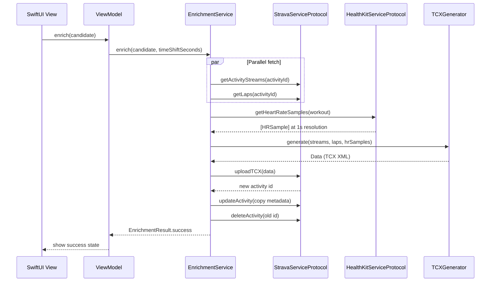

#  ArchitectureZwiftSync 

## Overview

A pure SwiftUI iOS app with no backend. All data stays on-device: Strava is queried via OAuth, HealthKit provides heart rate data, and the merged activity is re-uploaded to Strava as a TCX file. No server, no database, no cloud storage.

---

## Design Principles

- **Protocol-oriented**: Every service has a protocol (`StravaServiceProtocol`, `HealthKitServiceProtocol`, `KeychainServiceProtocol`) enabling dependency injection and testability.
- **Red-Green TDD**: All business logic has dedicated unit tests. Tests were written first, then code was made to pass.
- **Single responsibility**: Errors, overlap calculation, multipart encoding, and XML building each live in their own files.
- **No backend**: 100% on-device processing. Strava tokens stored in iOS Keychain.

---

## Enrichment Pipeline

```mermaid
flowchart TD
    A["User taps Enrich\non an activity"] --> B["StravaService\ngetActivityStreams(activityId)"]
    B --> C["StravaService\ngetLaps(activityId)"]
    A --> D["HealthKitService\nfindMatchingWorkouts(start, end)"]

 best match"]

    E --> F{Match confidence}
    F -- "exact / good" --> G["HealthKitService\ngetHeartRateSamples(workout)"]
    F -- "noMatch" --> Z["Show error: no HealthKit match"]

 TCX"]
    H --> I["StravaService\nuploadTCX(new)"]
    I --> J["StravaService\nupdateActivity(copy metadata)"]
    J --> K["StravaService\ndeleteActivity(old)"]
    K --> L[" enriched activity on Strava"]Done 
```

---

## Module Structure

```
ZwiftSync/Sources/
 App/
 ZwiftSyncApp.swift          # App entry point, environment setup   
 AppState.swift              # Global state with protocol-based DI   
 Config.swift                # Strava client ID, redirect URI, tolerances   
 Models/
 StravaActivity.swift        # Activity model (Codable, Equatable, Identifiable)   
 StravaStreams.swift          # Time-series streams with AnyCodableArray   
 StravaLap.swift             # Lap boundaries for TCX segments   
 StravaAuth.swift            # OAuth token, upload, and update models   
 EnrichmentModels.swift      # HRSample, EnrichmentCandidate, EnrichmentResult   
 MatchConfidence.swift       # Comparable enum: noMatch < low < medium < high   
 Errors/   
 StravaError.swift       # API-level errors       
 HealthKitError.swift    # HealthKit availability/auth errors       
 EnrichmentError.swift   # Pipeline-level errors       
 Protocols/
 StravaServiceProtocol.swift     # All Strava API methods   
 HealthKitServiceProtocol.swift  # HealthKit query methods   
 KeychainServiceProtocol.swift   # Token storage methods   
 Services/
 StravaService.swift         # Strava API + OAuth (injectable deps)   
 HealthKitService.swift      # HKWorkout + HR queries   
 EnrichmentService.swift     # Pipeline orchestrator (protocol deps)   
 TCXGenerator.swift          # XMLBuilder-based TCX generation   
 MatchConfidence
 ViewModels/
 ActivityListViewModel.swift # Loads + filters enrichable activities   
 EnrichViewModel.swift       # State machine for enrichment UI   
 Views/
 ContentView.swift           # Root navigation with DI   
 ActivityListView.swift      # Activity list with DI-injected service   
 EnrichDetailView.swift      # Confidence badge, time shift, enrich button   
 SetupView.swift             # First-run OAuth flow   
 SettingsView.swift          # Connections, about, disconnect   
 Utilities/
 KeychainService.swift       # iOS Keychain wrapper    
 PKCEHelper.swift            # PKCE code verifier + challenge    
 MultipartEncoder.swift      # Struct-based multipart/form-data builder    
 PresentationContextProvider.swift  # ASWebAuthentication anchor    
```

---

## Testing Strategy

| Layer | Test Count | Approach |
|-------|-----------|----------|
| Models | 6 test files | JSON decoding, computed properties, Equatable |
| Services | 5 test files | Mock protocols, pure function tests |
| ViewModels | 2 test files | State machine transitions, @MainActor |
| Utilities | 4 test files | Binary search, multipart encoding, PKCE |
| App | 2 test files | DI, state transitions, config validation |

All services tested via protocol  no real network, HealthKit, or Keychain access in tests.mocks 

---

## Data Flow



---

## Key Design Decisions

**Protocol-based DI.** Every external dependency is abstracted behind a protocol. Services accept protocols in their initializers with production defaults. Tests inject mock implementations.

**No backend.** All processing runs on the iPhone. No data ever leaves the device.

 delete original (safe order).

**Per-second heart rate.** `HRLookup` uses binary search for O(log n) nearest-neighbor matching of Apple Watch samples.

**XMLBuilder.** TCX generation uses a simple builder struct instead of raw string interpolation.

**OverlapCalculator.** Time overlap calculation extracted as a pure function with comprehensive boundary tests.

**PKCE, no client secret.** iOS apps can't securely store a client secret. PKCE makes OAuth secure without one.

---

## Tech Stack

| Layer | Technology |
|-------|-----------|
| Language | Swift 6 |
| UI | SwiftUI |
| Platform | iOS 17+ |
| Heart rate | HealthKit |
| Strava | API v3, OAuth 2.0 with PKCE |
| Upload format | TCX (Garmin/Strava standard) |
| Token storage | iOS Keychain |
| DI | Protocol-based constructor injection |
| Testing | XCTest + protocol mocks |
