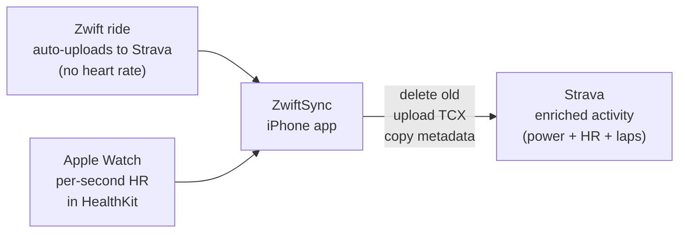
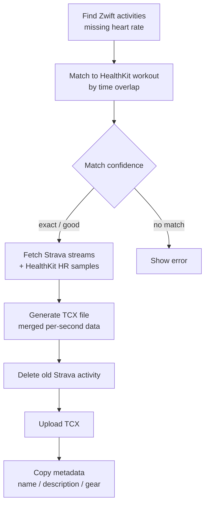

# ZwiftSync

> Enrich your Strava activities with Apple Watch heart rate data. One tap.

When you ride Zwift with an Apple Watch, your data is split: Zwift gets power, cadence, and speed; Apple Watch gets heart rate. ZwiftSync merges them into one clean Strava activity — no manual export, no desktop app, no server.

## What It Does

1. Finish your Zwift ride — it auto-uploads to Strava as usual
2. Open ZwiftSync → see activities missing heart rate, matched to Apple Watch workouts
3. Tap **"Enrich"** → done in ~10 seconds

The app deletes the original Strava activity, uploads a new TCX file with merged streams, then copies the original name, description, and gear back over. The result is indistinguishable from a native upload that had heart rate from the start.

## Enrichment Pipeline

## Features

- Auto-detects Zwift rides missing heart rate (last 30 activities)
- Confidence badge per match: exact, good, or no match
- Time-shift adjustment for clock drift between devices
- Per-second heart rate resolution from Apple Watch
- 100% on-device — no server, no account, no data collection

## Tech Stack

| Layer | Technology |
|-------|-----------|
| Language | Swift 6 |
| UI | SwiftUI |
| Platform | iOS 17+ |
| Heart rate | HealthKit |
| Strava | API v3, OAuth 2.0 with PKCE |
| Upload format | TCX (Garmin/Strava standard) |
| Token storage | iOS Keychain |

## Building

Open `ZwiftSync.xcodeproj` in Xcode 16+ and build for iOS 17+.

You'll need a Strava API application — register at https://www.strava.com/settings/api and add your Client ID and redirect URI to `Config.swift`.

## Privacy

All processing is on-device. No data is collected, no server exists. See [PRIVACY.md](PRIVACY.md).

## Architecture

See [ARCHITECTURE.md](ARCHITECTURE.md) for full component breakdown and data flow.

## License

MIT

